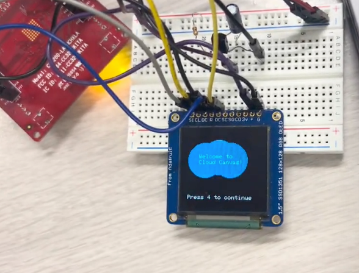

# Cloud-Canvas
Through CloudCanvas, two or more users can create, view, and collaborate on drawings. This is mine and Divya Raj's final project for our Embedded Systems class (EEC 172 at UC Davis).

# Description
Through CloudCanvas, two or more users can create, view, and collaborate on drawings.
We aim for CloudCanvas to be a low-cost toy that would encourage creativity among children in the engineering and artistic space without subjecting them to distractions prevalent in modern smart devices. The user can draw on their OLED by tilting their CC3200 board toward the direction they want to move their cursor, starting each stroke by pressing the ‘4’ button on their TV remote. Users can also use their TV remote to change the cursor's color by pressing the ‘3’ button. After a user creates a picture, it can be backed up to an AWS device shadow to allow multiple users to access and collaborate on the drawing. A user can press the ‘LAST’ button on their remote to make their drawing accessible to their peers through AWS, and press ‘2’ to retrieve drawings made by other users.

**[Watch The Full Demo Here (Youtube Link)](https://youtu.be/afgvy9xUxeQ)**